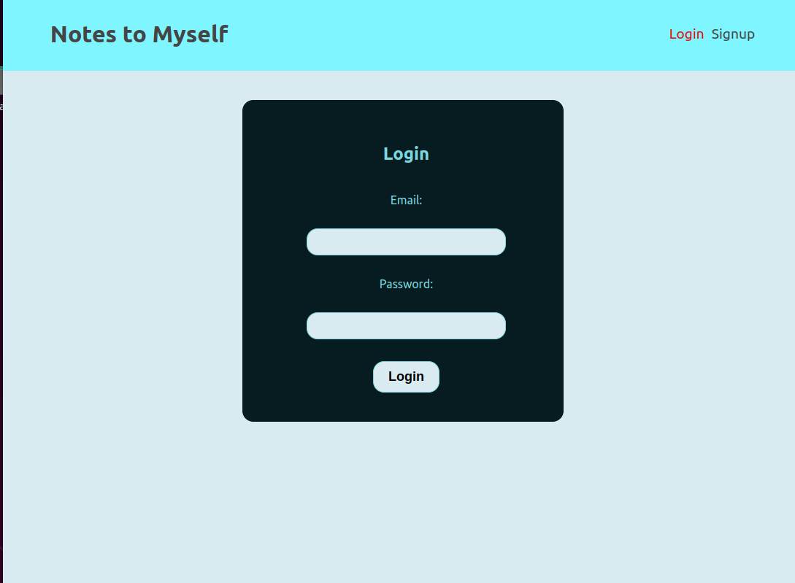
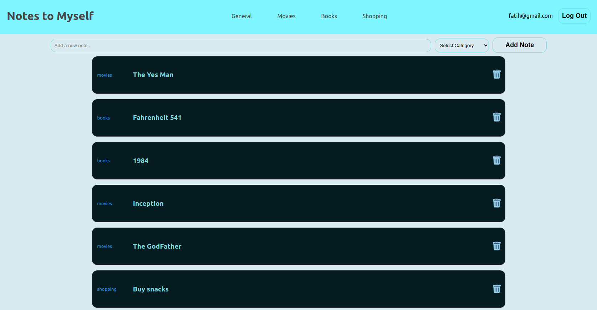

# Notes to Myself

## About

 This project is created for user who wants to take notes themselves. With a user login page every user will see only his/him notes. With the app you can create a new note or delete an existing note.By categorizing your notes, you can see which notes you have in which category.

## Structure

### Backend

        controllers
            todoController.js
            userController.js
        middleware
            requireAuth.js
        models
            todoModel.js
            userModel.js
        routes
            todo.js
            user.js

### Frontend

        public
            delete.png
            index.html
        src
            components
                AddTodoForm.js
                Navbar.js
                TodoDetail.js
            context
                Authcontext.js
                TodoContext.js
            hooks
                useAuthContext.js
                useLogin.js
                useLogout.js
                useSignup.js
                useTodoContext.js
            pages
                Home.js
                Login.js
                Signup.js
                categories.js
        App.js
        index.css
        index.js

## How to use Repo

    1- Clone Repository
    2- cd to backend folder and "npm init" then "npm install"

For connecting mongodb

    3- PORT= 000
    4- MONGO_URI =mongodb+srv://<username>:<password>@todoapp.rptgj0k.mongodb.net/?retryWrites=true&w=majority
    5 - SECRET=(choose yours)
    6- "npm run dev" for starting the server

    7- cd to frontend folder
    8- "npm start" for starting the server
